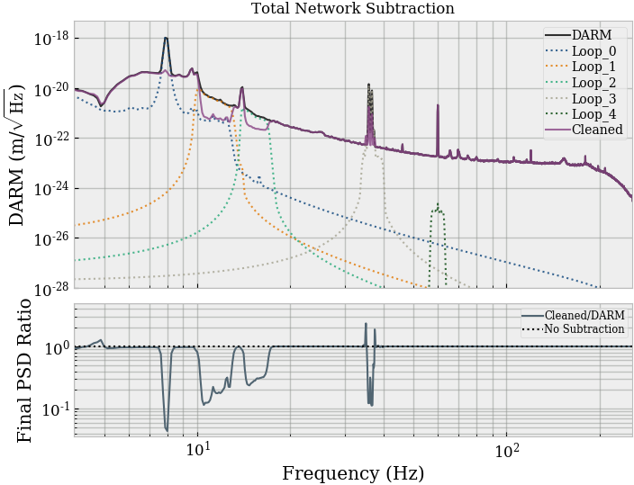
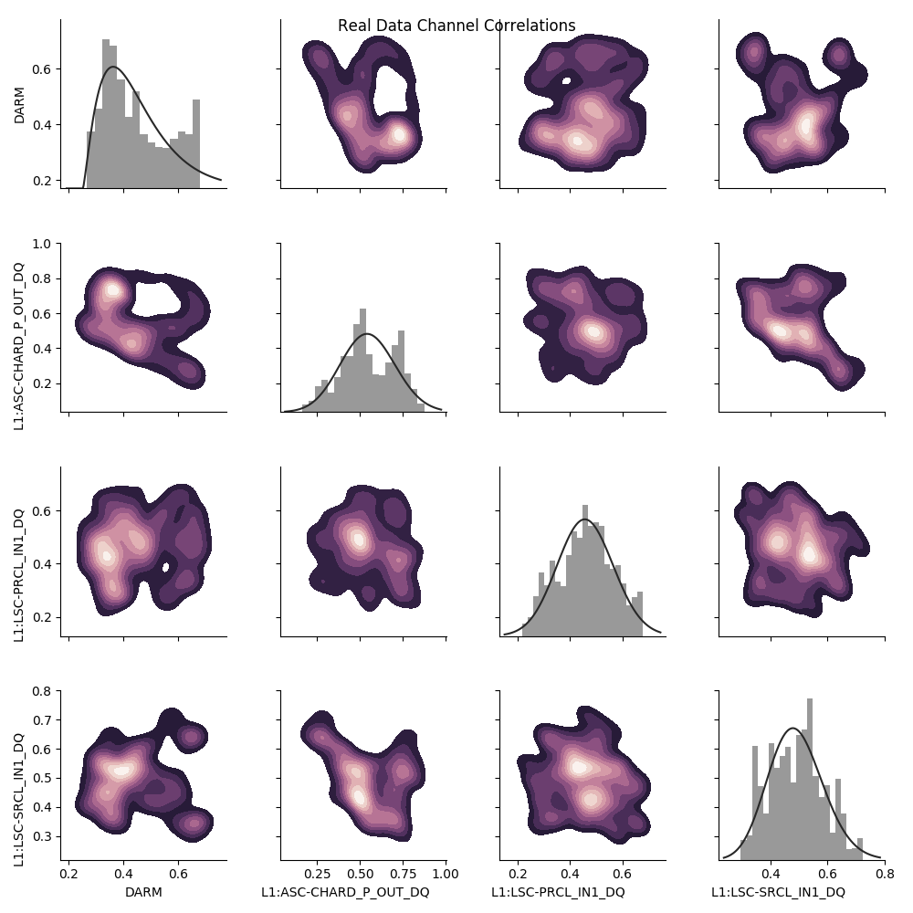

=========
Tutorials
=========

The sections below give a quick overview of the installation and
how to use some of the tools within the DeepClean package

Installation
------------
Installing the DeepClean repository is a simple task. First, 
clone the repository.

.. code-block:: bash

   $ git clone git@git.ligo.org:rich.ormiston/DeepClean.git

Next, cd to the base directory and run the install script.

.. code-block:: bash

   $ cd DeepClean
   $ chmod +x install.sh
   $ ./install.sh

And that's it! The virtual environment will be created for you and
all of the dependencies will be installed within it. NOTE: Before
the scipts may be run, you need to source the new environment

.. code-block:: bash

    $ source $HOME/deepclean_ve/bin/activate

Additionally, you must edit the config file, namely, change ``basedir`` to
the root directory of DeepClean (the rest of the defaults should work well).

.. warning:: If you have libraries installed in your ``$HOME/.local`` directory, those repositories will be not be installed. They will also not be found once you source the virtual environment, In that case, ``cd`` to the base directory of the repository and do ``pip install -r requirements.txt && pip install -e .``

Retrieving Data with ``getRegressionData.py``
---------------------------------------------
Before the network can be trained, there must be data to run on.
To acquire this data, use the ``getRegressionData.py`` script. 

This script will connect to nds2 and therefore requires you to
first deactivate the virtual environment and then to run

.. code-block:: bash

   $ kinit albert.einstein

There are many command line options associated that may be seen by using
the ``-h`` flag

.. code-block:: bash

   $ python getRegressionData.py -h
   usage: getRegressionData.py [-h] [--duration DURATION] [--fname FNAME]
                               [--fsup FSUP] [--ifo IFO] [--output OUTPUT]
                               [--portNumber PORTNUMBER]
                               [--time TIMES [TIMES ...]]
   optional arguments:
     -h, --help            show this help message and exit
     --duration DURATION, -d DURATION
                           data segment duration
     --fname FNAME, -f FNAME
                           channel list file name
     --fsup FSUP, -fs FSUP
                           sample frequency
     --ifo IFO, -i IFO     interferometer: L1 or H1
     --output OUTPUT, -o OUTPUT
                           output file name
     --portNumber PORTNUMBER, -p PORTNUMBER
                           port to connect to
     --time TIMES [TIMES ...], -t TIMES [TIMES ...]
                           start time. Ex. 2017-01-04 11:40:00

The output is a mat file. Suppose you want to collect data from Hanford
during the O2 run. Specifically, you'd like 2048 seconds of data starting
from Augist 14, 2017 02:00:00 using the channel list ``ChanList_H1.txt`` 
and want the outfile named ``H1_data_August.mat``. Then you would run

.. code-block:: bash
   
   $ python getRegressionData.py -i H1 -t 2017-08-14 02:00:00 -o H1_data_August.mat -f ChanList_H1.txt

The data will be saved to ``deepclean/Data.``

Running the Network
-------------------
Now that data has been collected, the network can be trained and evaluated.
Make sure that you are sourced and have edited the config file in the way 
you wish. If you do not wish to run a particular "loop", then set that loop
to ``False`` under the section ``To_Run``.

.. code-block:: bash

   $ dc-run-network -i path/to/configs.ini

Or, assuming that the config file being used is ``configs/configs.ini`` (i.e.,
with the default location/name), we may equivalently do

.. code-block:: bash

   $ dc-run-network 

The output plots are stored in ``deepclean/Plots``. An example of output generated
after running ``dc-run-network`` (with no arguments) on the data collected in the
above example is shown below

   PSD of DARM, the predictions for each network iteration and the total subtraction progress. There is improvement below ~38Hz.

Generating Webpages
-------------------
After plots have been created, webpages can be generated to help to visualize
the results and to collect all of the parameters used in that network evaluation.
These html pages are saved in ``html/day/`` and are not written over. Thus this
provides a simple way of tracking model progress. 

Building the webpages is simple.

.. code-block:: bash

   $ dc-webpage -i path/to/configs.ini

Again, the flag may be left off if the config file being used is
``configs/configs.ini``. **A sample webpage output can be viewed** here_

.. _here: https://ldas-jobs.ligo.caltech.edu/~rich.ormiston/DeepClean/html/day/20180310/

Visualizing Data
----------------
In machine learning, it is often helpful to plot the data to see if correlations
exist between input data streams. The command-line function ``spearman`` is 
for just that purpose. This script reads in the supplied data and calculates
the product of every permutation of the dataset channels and outputs those 
results to a csv if the Spearman "rho" coefficient or the Pearson's coefficient
are above the set threshold. 

The data can also be plotted against itself to look for correlations. The 
flags available are found by using the help flag

.. code-block:: bash

   usage: dc-spearman [-h] [--data_type DATA_TYPE] [--ifo IFO]
                      [--outputDir OUTPUTDIR] [--output OUTPUT] [--rho RHO]
                      [--pearson PEAR] [--threshold THRESHOLD]
   optional arguments:
     -h, --help            show this help message and exit
     --data_type DATA_TYPE, -d DATA_TYPE
                           real or mock data set
     --ifo IFO, -ifo IFO   L1 or H1
     --outputDir OUTPUTDIR, -dir OUTPUTDIR
                           directory in which to store results
     --output OUTPUT, -o OUTPUT
                           output file name
     --rho RHO, -r RHO     spearman's rho threshold value
     --pearson PEAR, -p PEAR
                           pearson's coefficient threshold value
     --threshold THRESHOLD, -t THRESHOLD
                           chose from: pearson, rho, and, or

A sample output plot is below

   3D channel correlations of the supplied data channels

Config File Parameters
----------------------
There are many network configurations and hyperparameters available
for wasy modification through the configuration file located in
``configs/configs.ini``. The available parameters are in the config file
and must remain there, so **do not delete them**. The parameters available are:

.. code-block:: ini

   [Data]
   datafile  = ../deepclean/Data/H1_data_array.mat
   data_type = real
   
   [Webpage]
   basedir = /home/richard.feynman/git_repositories/DeepClean/
   
   [To_Run]
   Loop_0 = True
   Loop_1 = True
   Loop_2 = True
   Loop_3 = True
   Loop_4 = True
   
   [Loop_0]
   beta_1     = 0.9
   beta_2     = 0.999
   decay      = None
   epochs     = 3
   epsilon    = 1e-8
   fmin       = 4
   fmax       = 256
   hc_offset  = 0
   highcut    = 12.0
   loss       = mse
   lowcut     = 3.0
   lr         = None
   momentum   = 0.0
   nesterov   = False
   N_bp       = 8
   optimizer  = adam
   plotDir    = ../deepclean/Plots
   postFilter = True
   preFilter  = True
   rho        = None
   subsystems = all
   tfrac      = 0.5
   ts         = 2

The parameters listed under ``Loop_0`` are also available 
to every subsequent "Loop" section. Currently, the code can
handle up to 6 independent network iterations. 
